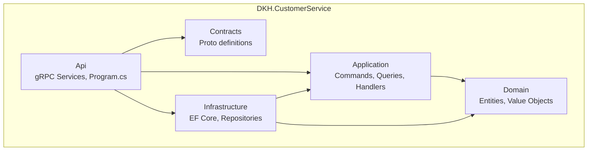
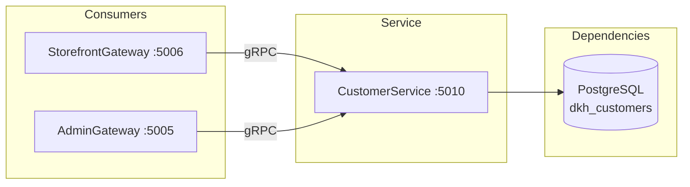

# DKH.CustomerService -- Architecture

## Overview

DKH.CustomerService is a .NET 10 microservice following Clean Architecture with CQRS (MediatR). It manages customer profiles, delivery addresses, wishlists, preferences, contact verification, and external identity linking for Telegram Mini App storefronts.

## Architecture Documentation

### Central Architecture Repository

Detailed architecture documentation is maintained in the DKH.Architecture repository:

- **English:** [DKH.Architecture -- CustomerService (EN)](https://github.com/GZDKH/DKH.Architecture/blob/main/en/services/backend/customer-service/README.md)
- **Russian:** [DKH.Architecture -- CustomerService (RU)](https://github.com/GZDKH/DKH.Architecture/blob/main/ru/services/backend/customer-service/README.md)

### Local Documentation

```
docs/
├── README.md              # Documentation index
├── domain-model.md        # Entities, value objects, enums, domain events
├── grpc-api.md            # gRPC service definitions and methods
├── database.md            # Schema, tables, indexes, migrations
├── architecture.md        # This file -- architecture overview
└── ru/                    # Russian translations (pending)
```

## Project Structure



### Layer Responsibilities

| Layer | Project | Responsibility |
|-------|---------|---------------|
| **Api** | `DKH.CustomerService.Api` | gRPC service implementations, DI registration, Program.cs entry point |
| **Application** | `DKH.CustomerService.Application` | MediatR command/query handlers, FluentValidation validators, mappers |
| **Domain** | `DKH.CustomerService.Domain` | Entities, value objects, enums, domain events, aggregate roots |
| **Infrastructure** | `DKH.CustomerService.Infrastructure` | EF Core DbContext, entity configurations, repositories, migrations |
| **Contracts** | `DKH.CustomerService.Contracts` | Protobuf schema definitions (`proto/customer/`) |

## Key Patterns

### Clean Architecture

Dependencies flow inward: Api -> Application -> Domain. Infrastructure implements interfaces defined in Application/Domain.

### CQRS with MediatR

Commands and queries are separated into distinct handler classes under `Application/Features/<Entity>/Commands/` and `Application/Features/<Entity>/Queries/`.

### DDD with Aggregate Root

`CustomerProfileEntity` is the single aggregate root. All mutations to child entities (addresses, wishlist items, external identities) go through the aggregate or are scoped to the aggregate boundary.

### Multi-Tenancy

All data is scoped by `StorefrontId` using the `IPlatformStorefrontScoped` interface from DKH.Platform. Query filters enforce tenant isolation automatically.

### GDPR Compliance

The service supports data export (`ExportCustomerData`) and anonymization (`DeleteCustomerData` / `Anonymize`) for GDPR right-to-erasure and right-to-portability.

## Service Communication



### Consumers

| Consumer | Protocol | Operations |
|----------|----------|------------|
| StorefrontGateway | gRPC | Profile CRUD, addresses, wishlist, preferences, verification, identity linking |
| AdminGateway | gRPC | Customer management, search, block/unblock, GDPR operations |
| OrderService | gRPC | Address lookup for delivery |
| CartService | Reference | Links via CustomerId |

## Technology Stack

| Component | Technology | Version |
|-----------|-----------|---------|
| Runtime | .NET | 10.0 |
| ORM | Entity Framework Core | 10.0.2 |
| Database Provider | Npgsql | 10.0.0 |
| Database | PostgreSQL | dkh_customers |
| Protocol | gRPC (HTTP/2) | Port 5010 |
| CQRS | MediatR | via DKH.Platform |
| Validation | FluentValidation | via DKH.Platform |
| Platform | DKH.Platform | Shared infrastructure |

## Configuration

| Setting | Location | Description |
|---------|----------|-------------|
| `ConnectionStrings:Default` | `appsettings.json` | PostgreSQL connection string |
| `Platform:*` | `appsettings.json` | DKH.Platform configuration sections |
| Port | `5010` | gRPC service port |

*Last updated: February 2026*
