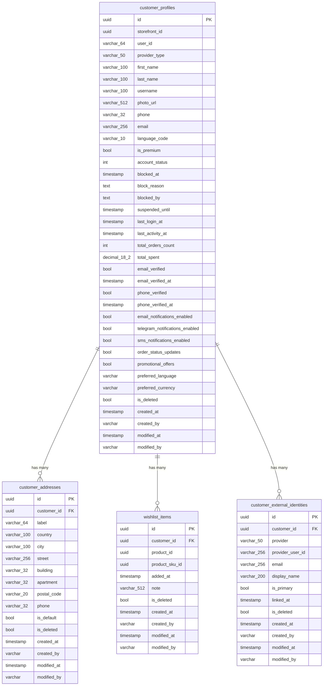

# DKH.CustomerService -- Database

## Overview

DKH.CustomerService uses PostgreSQL as its primary data store, accessed through Entity Framework Core 10.0.2 with Npgsql 10.0.0. The database follows a single-schema design with soft-delete query filters on all tables.

**Database:** `dkh_customers`
**Connection:** `Host=localhost;Port=5432;Database=dkh_customers`
**ORM:** Entity Framework Core 10.0.2
**Provider:** Npgsql.EntityFrameworkCore.PostgreSQL 10.0.0

## ER Diagram



## Tables

### customer_profiles

The primary table storing customer profile data. Value objects (`AccountStatus`, `ContactVerification`, `CustomerPreferences`) are flattened into columns using EF Core owned types.

**Columns:**

| Column | Type | Nullable | Default | Description |
|--------|------|----------|---------|-------------|
| `id` | `uuid` | No | | Primary key |
| `storefront_id` | `uuid` | No | | Multi-tenancy scope |
| `user_id` | `varchar(64)` | No | | External user identifier |
| `provider_type` | `varchar(50)` | No | `'Telegram'` | Authentication provider |
| `first_name` | `varchar(100)` | No | | First name |
| `last_name` | `varchar(100)` | Yes | | Last name |
| `username` | `varchar(100)` | Yes | | Username / handle |
| `photo_url` | `varchar(512)` | Yes | | Profile photo URL |
| `phone` | `varchar(32)` | Yes | | Phone number |
| `email` | `varchar(256)` | Yes | | Email address |
| `language_code` | `varchar(10)` | No | | Preferred language |
| `is_premium` | `bool` | No | `false` | Premium flag |
| `account_status` | `int` | No | `0` | Account status enum value |
| `blocked_at` | `timestamp` | Yes | | Block timestamp |
| `block_reason` | `text` | Yes | | Block reason |
| `blocked_by` | `text` | Yes | | Admin who blocked |
| `suspended_until` | `timestamp` | Yes | | Suspension expiry |
| `last_login_at` | `timestamp` | Yes | | Last login time |
| `last_activity_at` | `timestamp` | Yes | | Last activity time |
| `total_orders_count` | `int` | No | `0` | Lifetime order count |
| `total_spent` | `decimal(18,2)` | No | `0` | Lifetime spending |
| `email_verified` | `bool` | No | `false` | Email verified flag |
| `email_verified_at` | `timestamp` | Yes | | Email verification time |
| `phone_verified` | `bool` | No | `false` | Phone verified flag |
| `phone_verified_at` | `timestamp` | Yes | | Phone verification time |
| `email_notifications_enabled` | `bool` | No | `true` | Email notifications |
| `telegram_notifications_enabled` | `bool` | No | `true` | Telegram notifications |
| `sms_notifications_enabled` | `bool` | No | `false` | SMS notifications |
| `order_status_updates` | `bool` | No | `true` | Order status updates |
| `promotional_offers` | `bool` | No | `false` | Promotional offers |
| `preferred_language` | `varchar` | No | `'en'` | Display language |
| `preferred_currency` | `varchar` | No | `'USD'` | Display currency |
| `is_deleted` | `bool` | No | `false` | Soft-delete flag |
| `created_at` | `timestamp` | No | | Creation timestamp |
| `created_by` | `varchar` | Yes | | Created by user |
| `modified_at` | `timestamp` | Yes | | Last modification |
| `modified_by` | `varchar` | Yes | | Modified by user |

**Indexes:**

| Name | Columns | Type | Notes |
|------|---------|------|-------|
| `PK_customer_profiles` | `id` | Primary Key | |
| `IX_customer_profiles_storefront_user` | `storefront_id, user_id` | Unique | Ensures one profile per user per storefront |
| `IX_customer_profiles_email` | `email` | Partial (non-null) | For email lookups |
| `IX_customer_profiles_phone` | `phone` | Partial (non-null) | For phone lookups |

**Query Filter:** `is_deleted = false`

---

### customer_addresses

Delivery addresses belonging to a customer profile.

**Columns:**

| Column | Type | Nullable | Default | Description |
|--------|------|----------|---------|-------------|
| `id` | `uuid` | No | | Primary key |
| `customer_id` | `uuid` | No | | FK to customer_profiles |
| `label` | `varchar(64)` | No | | Address label |
| `country` | `varchar(100)` | No | | Country |
| `city` | `varchar(100)` | No | | City |
| `street` | `varchar(256)` | Yes | | Street |
| `building` | `varchar(32)` | Yes | | Building number |
| `apartment` | `varchar(32)` | Yes | | Apartment number |
| `postal_code` | `varchar(20)` | Yes | | Postal code |
| `phone` | `varchar(32)` | Yes | | Contact phone |
| `is_default` | `bool` | No | `false` | Default address flag |
| `is_deleted` | `bool` | No | `false` | Soft-delete flag |
| `created_at` | `timestamp` | No | | Creation timestamp |
| `created_by` | `varchar` | Yes | | Created by user |
| `modified_at` | `timestamp` | Yes | | Last modification |
| `modified_by` | `varchar` | Yes | | Modified by user |

**Indexes:**

| Name | Columns | Type | Notes |
|------|---------|------|-------|
| `PK_customer_addresses` | `id` | Primary Key | |
| `IX_customer_addresses_customer_id` | `customer_id` | Non-unique | For customer lookup |
| `IX_customer_addresses_default` | `customer_id, is_default` | Unique filtered | `WHERE is_default = true` -- one default per customer |

**Foreign Keys:**

| Column | References | On Delete |
|--------|-----------|-----------|
| `customer_id` | `customer_profiles(id)` | CASCADE |

**Query Filter:** `is_deleted = false`

---

### wishlist_items

Products saved to a customer's wishlist.

**Columns:**

| Column | Type | Nullable | Default | Description |
|--------|------|----------|---------|-------------|
| `id` | `uuid` | No | | Primary key |
| `customer_id` | `uuid` | No | | FK to customer_profiles |
| `product_id` | `uuid` | No | | Product reference |
| `product_sku_id` | `uuid` | Yes | | Specific SKU variant |
| `added_at` | `timestamp` | No | | When added to wishlist |
| `note` | `varchar(512)` | Yes | | Customer note |
| `is_deleted` | `bool` | No | `false` | Soft-delete flag |
| `created_at` | `timestamp` | No | | Creation timestamp |
| `created_by` | `varchar` | Yes | | Created by user |
| `modified_at` | `timestamp` | Yes | | Last modification |
| `modified_by` | `varchar` | Yes | | Modified by user |

**Indexes:**

| Name | Columns | Type | Notes |
|------|---------|------|-------|
| `PK_wishlist_items` | `id` | Primary Key | |
| `IX_wishlist_items_customer_id` | `customer_id` | Non-unique | For customer lookup |
| `IX_wishlist_items_unique` | `customer_id, product_id, product_sku_id` | Unique | One entry per product/SKU per customer |

**Foreign Keys:**

| Column | References | On Delete |
|--------|-----------|-----------|
| `customer_id` | `customer_profiles(id)` | CASCADE |

**Query Filter:** `is_deleted = false`

---

### customer_external_identities

External identity providers linked to customer accounts (e.g., Google, Apple, email-based).

**Columns:**

| Column | Type | Nullable | Default | Description |
|--------|------|----------|---------|-------------|
| `id` | `uuid` | No | | Primary key |
| `customer_id` | `uuid` | No | | FK to customer_profiles |
| `provider` | `varchar(50)` | No | | Identity provider name |
| `provider_user_id` | `varchar(256)` | No | | User ID at provider |
| `email` | `varchar(256)` | Yes | | Email from provider |
| `display_name` | `varchar(200)` | Yes | | Display name from provider |
| `is_primary` | `bool` | No | `false` | Primary identity flag |
| `linked_at` | `timestamp` | No | | When the identity was linked |
| `is_deleted` | `bool` | No | `false` | Soft-delete flag |
| `created_at` | `timestamp` | No | | Creation timestamp |
| `created_by` | `varchar` | Yes | | Created by user |
| `modified_at` | `timestamp` | Yes | | Last modification |
| `modified_by` | `varchar` | Yes | | Modified by user |

**Indexes:**

| Name | Columns | Type | Notes |
|------|---------|------|-------|
| `PK_customer_external_identities` | `id` | Primary Key | |
| `IX_external_identities_provider_user` | `provider, provider_user_id` | Unique | One user per provider |
| `IX_external_identities_customer_id` | `customer_id` | Non-unique | For customer lookup |
| `IX_external_identities_provider_email` | `provider, email` | Non-unique | For provider+email lookups |

**Foreign Keys:**

| Column | References | On Delete |
|--------|-----------|-----------|
| `customer_id` | `customer_profiles(id)` | CASCADE |

**Query Filter:** `is_deleted = false`

---

## Migrations

| Migration | Date | Description |
|-----------|------|-------------|
| `20260205083533_InitialCreate` | 2026-02-05 | Initial schema with customer_profiles, customer_addresses, wishlist_items, customer_external_identities |
| `20260216010139_AddProviderTypeRenameUserId` | 2026-02-16 | Added `provider_type` column, renamed user identifier column to `user_id` |
| `20260216070533_202602161200_AddIsPremium` | 2026-02-16 | Added `is_premium` column to customer_profiles |

### Running Migrations

```bash
# Apply all pending migrations
dotnet ef database update \
  --project DKH.CustomerService.Infrastructure \
  --startup-project DKH.CustomerService.Api

# Create a new migration
dotnet ef migrations add <MigrationName> \
  --project DKH.CustomerService.Infrastructure \
  --startup-project DKH.CustomerService.Api

# Generate SQL script
dotnet ef migrations script \
  --project DKH.CustomerService.Infrastructure \
  --startup-project DKH.CustomerService.Api
```

## Design Decisions

- **Soft delete** -- All tables use `is_deleted` flag with global query filters. Physical deletion only occurs during GDPR anonymization.
- **Value objects as owned types** -- `AccountStatus`, `ContactVerification`, and `CustomerPreferences` are mapped as EF Core owned types, flattening their properties into the `customer_profiles` table.
- **Cascade deletes** -- Child entities (addresses, wishlist items, external identities) are cascade-deleted when a customer profile is removed.
- **Partial indexes on email/phone** -- Only non-null values are indexed to optimize lookups while allowing nulls.
- **Unique filtered index on default address** -- Ensures at most one default address per customer at the database level.

*Last updated: February 2026*
