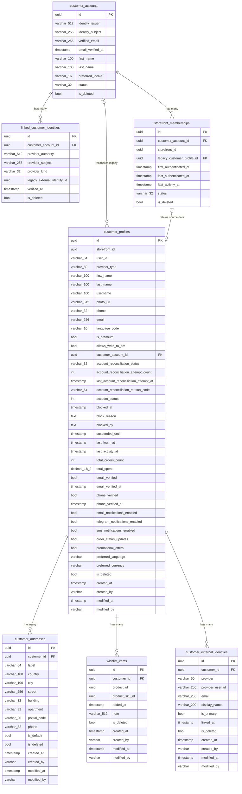

# DKH.CustomerService -- Database

## Overview

DKH.CustomerService uses PostgreSQL as its primary data store, accessed through Entity Framework Core 10.0.2 with Npgsql 10.0.0. The database follows a single-schema design with soft-delete query filters on all tables.

**Database:** `dkh_customers`
**Connection:** `Host=localhost;Port=5432;Database=dkh_customers`
**ORM:** Entity Framework Core 10.0.2
**Provider:** Npgsql.EntityFrameworkCore.PostgreSQL 10.0.0

## ER Diagram


```mermaid
erDiagram
    customer_accounts {
        uuid id PK
        varchar_512 identity_issuer
        varchar_256 identity_subject
        varchar_256 verified_email
        timestamp email_verified_at
        varchar_100 first_name
        varchar_100 last_name
        varchar_16 preferred_locale
        varchar_32 status
        bool is_deleted
    }

    linked_customer_identities {
        uuid id PK
        uuid customer_account_id FK
        varchar_512 provider_authority
        varchar_256 provider_subject
        varchar_32 provider_kind
        uuid legacy_external_identity_id
        timestamp verified_at
        bool is_deleted
    }

    storefront_memberships {
        uuid id PK
        uuid customer_account_id FK
        uuid storefront_id
        uuid legacy_customer_profile_id FK
        timestamp first_authenticated_at
        timestamp last_authenticated_at
        timestamp last_activity_at
        varchar_32 status
        bool is_deleted
    }

    customer_profiles {
        uuid id PK
        uuid storefront_id
        varchar_64 user_id
        varchar_50 provider_type
        varchar_100 first_name
        varchar_100 last_name
        varchar_100 username
        varchar_512 photo_url
        varchar_32 phone
        varchar_256 email
        varchar_10 language_code
        bool is_premium
        bool allows_write_to_pm
        uuid customer_account_id FK
        varchar_32 account_reconciliation_status
        int account_reconciliation_attempt_count
        timestamp last_account_reconciliation_attempt_at
        varchar_64 account_reconciliation_reason_code
        int account_status
        timestamp blocked_at
        text block_reason
        text blocked_by
        timestamp suspended_until
        timestamp last_login_at
        timestamp last_activity_at
        int total_orders_count
        decimal_18_2 total_spent
        bool email_verified
        timestamp email_verified_at
        bool phone_verified
        timestamp phone_verified_at
        bool email_notifications_enabled
        bool telegram_notifications_enabled
        bool sms_notifications_enabled
        bool order_status_updates
        bool promotional_offers
        varchar preferred_language
        varchar preferred_currency
        bool is_deleted
        timestamp created_at
        varchar created_by
        timestamp modified_at
        varchar modified_by
    }

    customer_addresses {
        uuid id PK
        uuid customer_id FK
        varchar_64 label
        varchar_100 country
        varchar_100 city
        varchar_256 street
        varchar_32 building
        varchar_32 apartment
        varchar_20 postal_code
        varchar_32 phone
        bool is_default
        bool is_deleted
        timestamp created_at
        varchar created_by
        timestamp modified_at
        varchar modified_by
    }

    wishlist_items {
        uuid id PK
        uuid customer_id FK
        uuid product_id
        uuid product_sku_id
        timestamp added_at
        varchar_512 note
        bool is_deleted
        timestamp created_at
        varchar created_by
        timestamp modified_at
        varchar modified_by
    }

    customer_external_identities {
        uuid id PK
        uuid customer_id FK
        varchar_50 provider
        varchar_256 provider_user_id
        varchar_256 email
        varchar_200 display_name
        bool is_primary
        timestamp linked_at
        bool is_deleted
        timestamp created_at
        varchar created_by
        timestamp modified_at
        varchar modified_by
    }

    customer_profiles ||--o{ customer_addresses : "has many"
    customer_profiles ||--o{ wishlist_items : "has many"
    customer_profiles ||--o{ customer_external_identities : "has many"
    customer_accounts ||--o{ linked_customer_identities : "has many"
    customer_accounts ||--o{ storefront_memberships : "has many"
    customer_accounts o|--o{ customer_profiles : "reconciles legacy"
    storefront_memberships o|--o| customer_profiles : "retains source data"
```

## Tables

### customer_profiles

The primary table storing customer profile data. Value objects (`AccountStatus`, `ContactVerification`, `CustomerPreferences`) are flattened into columns using EF Core owned types.

**Columns:**

| Column | Type | Nullable | Default | Description |
|--------|------|----------|---------|-------------|
| `id` | `uuid` | No | | Primary key |
| `storefront_id` | `uuid` | No | | Multi-tenancy scope |
| `user_id` | `varchar(64)` | No | | External user identifier |
| `provider_type` | `varchar(50)` | No | `'Telegram'` | Authentication provider |
| `first_name` | `varchar(100)` | No | | First name |
| `last_name` | `varchar(100)` | Yes | | Last name |
| `username` | `varchar(100)` | Yes | | Username / handle |
| `photo_url` | `varchar(512)` | Yes | | Profile photo URL |
| `phone` | `varchar(32)` | Yes | | Phone number |
| `email` | `varchar(256)` | Yes | | Email address |
| `language_code` | `varchar(10)` | No | | Preferred language |
| `is_premium` | `bool` | No | `false` | Premium flag |
| `allows_write_to_pm` | `bool` | No | `false` | Telegram permission flag for proactive PM writes |
| `customer_account_id` | `uuid` | Yes | | FK set only after authoritative-subject reconciliation |
| `account_reconciliation_status` | `varchar(32)` | No | `PendingProof` | Restartable state: PendingProof, Processing, Linked, or Quarantined |
| `account_reconciliation_attempt_count` | `int` | No | `0` | Number of reconciliation claims |
| `last_account_reconciliation_attempt_at` | `timestamp` | Yes | | Last claim/completion/quarantine time |
| `account_reconciliation_reason_code` | `varchar(64)` | Yes | | Allowlisted non-PII quarantine code |
| `account_status` | `int` | No | `0` | Account status enum value |
| `blocked_at` | `timestamp` | Yes | | Block timestamp |
| `block_reason` | `text` | Yes | | Block reason |
| `blocked_by` | `text` | Yes | | Admin who blocked |
| `suspended_until` | `timestamp` | Yes | | Suspension expiry |
| `last_login_at` | `timestamp` | Yes | | Last login time |
| `last_activity_at` | `timestamp` | Yes | | Last activity time |
| `total_orders_count` | `int` | No | `0` | Lifetime order count |
| `total_spent` | `decimal(18,2)` | No | `0` | Lifetime spending |
| `email_verified` | `bool` | No | `false` | Email verified flag |
| `email_verified_at` | `timestamp` | Yes | | Email verification time |
| `phone_verified` | `bool` | No | `false` | Phone verified flag |
| `phone_verified_at` | `timestamp` | Yes | | Phone verification time |
| `email_notifications_enabled` | `bool` | No | `true` | Email notifications |
| `telegram_notifications_enabled` | `bool` | No | `true` | Telegram notifications |
| `sms_notifications_enabled` | `bool` | No | `false` | SMS notifications |
| `order_status_updates` | `bool` | No | `true` | Order status updates |
| `promotional_offers` | `bool` | No | `false` | Promotional offers |
| `preferred_language` | `varchar` | No | `'en'` | Display language |
| `preferred_currency` | `varchar` | No | `'USD'` | Display currency |
| `is_deleted` | `bool` | No | `false` | Soft-delete flag |
| `created_at` | `timestamp` | No | | Creation timestamp |
| `created_by` | `varchar` | Yes | | Created by user |
| `modified_at` | `timestamp` | Yes | | Last modification |
| `modified_by` | `varchar` | Yes | | Modified by user |

**Indexes:**

| Name | Columns | Type | Notes |
|------|---------|------|-------|
| `PK_customer_profiles` | `id` | Primary Key | |
| `IX_customer_profiles_storefront_user` | `storefront_id, user_id` | Unique | Ensures one profile per user per storefront |
| `IX_customer_profiles_email` | `email` | Partial (non-null) | For email lookups |
| `IX_customer_profiles_phone` | `phone` | Partial (non-null) | For phone lookups |

**Query Filter:** `is_deleted = false`

---

### customer_addresses

Delivery addresses belonging to a customer profile.

**Columns:**

| Column | Type | Nullable | Default | Description |
|--------|------|----------|---------|-------------|
| `id` | `uuid` | No | | Primary key |
| `customer_id` | `uuid` | No | | FK to customer_profiles |
| `label` | `varchar(64)` | No | | Address label |
| `country` | `varchar(100)` | No | | Country |
| `city` | `varchar(100)` | No | | City |
| `street` | `varchar(256)` | Yes | | Street |
| `building` | `varchar(32)` | Yes | | Building number |
| `apartment` | `varchar(32)` | Yes | | Apartment number |
| `postal_code` | `varchar(20)` | Yes | | Postal code |
| `phone` | `varchar(32)` | Yes | | Contact phone |
| `is_default` | `bool` | No | `false` | Default address flag |
| `is_deleted` | `bool` | No | `false` | Soft-delete flag |
| `created_at` | `timestamp` | No | | Creation timestamp |
| `created_by` | `varchar` | Yes | | Created by user |
| `modified_at` | `timestamp` | Yes | | Last modification |
| `modified_by` | `varchar` | Yes | | Modified by user |

**Indexes:**

| Name | Columns | Type | Notes |
|------|---------|------|-------|
| `PK_customer_addresses` | `id` | Primary Key | |
| `IX_customer_addresses_customer_id` | `customer_id` | Non-unique | For customer lookup |
| `IX_customer_addresses_default` | `customer_id, is_default` | Unique filtered | `WHERE is_default = true` -- one default per customer |

**Foreign Keys:**

| Column | References | On Delete |
|--------|-----------|-----------|
| `customer_id` | `customer_profiles(id)` | CASCADE |

**Query Filter:** `is_deleted = false`

---

### wishlist_items

Products saved to a customer's wishlist.

**Columns:**

| Column | Type | Nullable | Default | Description |
|--------|------|----------|---------|-------------|
| `id` | `uuid` | No | | Primary key |
| `customer_id` | `uuid` | No | | FK to customer_profiles |
| `product_id` | `uuid` | No | | Product reference |
| `product_sku_id` | `uuid` | Yes | | Specific SKU variant |
| `added_at` | `timestamp` | No | | When added to wishlist |
| `note` | `varchar(512)` | Yes | | Customer note |
| `is_deleted` | `bool` | No | `false` | Soft-delete flag |
| `created_at` | `timestamp` | No | | Creation timestamp |
| `created_by` | `varchar` | Yes | | Created by user |
| `modified_at` | `timestamp` | Yes | | Last modification |
| `modified_by` | `varchar` | Yes | | Modified by user |

**Indexes:**

| Name | Columns | Type | Notes |
|------|---------|------|-------|
| `PK_wishlist_items` | `id` | Primary Key | |
| `IX_wishlist_items_customer_id` | `customer_id` | Non-unique | For customer lookup |
| `IX_wishlist_items_unique` | `customer_id, product_id, product_sku_id` | Unique | One entry per product/SKU per customer |

**Foreign Keys:**

| Column | References | On Delete |
|--------|-----------|-----------|
| `customer_id` | `customer_profiles(id)` | CASCADE |

**Query Filter:** `is_deleted = false`

---

### customer_external_identities

External identity providers linked to customer accounts (e.g., Google, Apple, email-based).

**Columns:**

| Column | Type | Nullable | Default | Description |
|--------|------|----------|---------|-------------|
| `id` | `uuid` | No | | Primary key |
| `customer_id` | `uuid` | No | | FK to customer_profiles |
| `provider` | `varchar(50)` | No | | Identity provider name |
| `provider_user_id` | `varchar(256)` | No | | User ID at provider |
| `email` | `varchar(256)` | Yes | | Email from provider |
| `display_name` | `varchar(200)` | Yes | | Display name from provider |
| `is_primary` | `bool` | No | `false` | Primary identity flag |
| `linked_at` | `timestamp` | No | | When the identity was linked |
| `is_deleted` | `bool` | No | `false` | Soft-delete flag |
| `created_at` | `timestamp` | No | | Creation timestamp |
| `created_by` | `varchar` | Yes | | Created by user |
| `modified_at` | `timestamp` | Yes | | Last modification |
| `modified_by` | `varchar` | Yes | | Modified by user |

**Indexes:**

| Name | Columns | Type | Notes |
|------|---------|------|-------|
| `PK_customer_external_identities` | `id` | Primary Key | |
| `IX_external_identities_provider_user` | `provider, provider_user_id` | Unique | One user per provider |
| `IX_external_identities_customer_id` | `customer_id` | Non-unique | For customer lookup |
| `IX_external_identities_provider_email` | `provider, email` | Non-unique | For provider+email lookups |

**Foreign Keys:**

| Column | References | On Delete |
|--------|-----------|-----------|
| `customer_id` | `customer_profiles(id)` | CASCADE |

**Query Filter:** `is_deleted = false`

---

### customer_accounts

Global customer identities keyed by the authoritative Keycloak issuer and
subject. Verified email is profile data and is intentionally not a unique or
merge key.

| Column | Type | Nullable | Description |
|--------|------|----------|-------------|
| `Id` | `uuid` | No | Primary key |
| `identity_issuer` | `varchar(512)` | No | Normalized trusted Keycloak issuer |
| `identity_subject` | `varchar(256)` | No | Keycloak `sub` within the issuer namespace |
| `verified_email` | `varchar(256)` | No | Most recently verified email |
| `email_verified_at` | `timestamp` | No | Time of authoritative email proof |
| `first_name`, `last_name` | `varchar(100)` | Yes | Global core profile names |
| `preferred_locale` | `varchar(16)` | No | Preferred locale |
| `status` | `varchar(32)` | No | Active, Blocked, or DeletionPending |

Indexes: unique `ux_customer_accounts_issuer_subject`; non-unique
`ix_customer_accounts_verified_email`. The uniqueness constraint is not
filtered by soft delete, so the same authoritative identity cannot exist twice.
Full GDPR deletion first moves the soft-deleted tombstone to a synthetic
`deleted:` identity namespace, allowing a later login to create a fresh account
without reconnecting retained anonymous audit data.

### linked_customer_identities

Provider identities linked only after fresh provider proof. The globally unique
`(provider_authority, provider_subject)` pair prevents one provider identity
from being attached to multiple accounts. `legacy_external_identity_id` records
reconciliation provenance without deleting or moving the legacy row.

### storefront_memberships

Merchant-visible relationship created on authenticated first touch. Unique
`(customer_account_id, storefront_id)` prevents duplicate memberships;
`legacy_customer_profile_id` links at most one membership to the original
storefront-scoped profile that continues to own wishlist items, addresses,
preferences, statistics, and merchant-specific state during migration.

### Reconciliation and rollback order

1. Deploy this additive schema while existing v1 profile APIs continue using
   `customer_profiles`; no legacy table or column is removed.
2. Existing and new legacy profiles start in `PendingProof`. A trusted
   authenticated flow claims a row as `Processing`, increments its persisted
   attempt counter, and links it only when the Keycloak issuer and `sub` are
   proven. Email text never selects an account.
3. Stale `Processing` rows are safe to claim again. Conflicts such as multiple
   subjects or an identity already owned by another account become
   `Quarantined` with an allowlisted non-PII reason code; an operator may return
   them to `PendingProof` after resolution.
4. Linked provider identities are copied with a unique legacy provenance id;
   legacy identity and storefront data remain intact until the compatibility
   window closes.
5. Roll back application consumers first. The old schema remains authoritative;
   the migration `Down` path only removes additive global-account structures
   and nullable reconciliation columns.

---

## Migrations

| Migration | Date | Description |
|-----------|------|-------------|
| `20260205083533_InitialCreate` | 2026-02-05 | Initial schema with customer_profiles, customer_addresses, wishlist_items, customer_external_identities |
| `20260216010139_AddProviderTypeRenameUserId` | 2026-02-16 | Added `provider_type` column, renamed user identifier column to `user_id` |
| `20260216070533_202602161200_AddIsPremium` | 2026-02-16 | Added `is_premium` column to customer_profiles |
| `20260406082057_20260406_AddAllowsWriteToPm` | 2026-04-06 | Added `allows_write_to_pm` column to customer_profiles |
| `20260804131014_AddGlobalCustomerAccounts` | 2026-08-04 | Added global accounts, linked identities, lazy storefront memberships, and restartable legacy reconciliation state |
| `20260921012532_AddPrivateStructuredProductExperience` | 2026-09-21 | Added owner-private product experiences with normalized typed observations and tags |
| `20261008115437_LimitActiveProductExperienceSummary` | 2026-10-08 | Restricts the collection-summary unique index to active rows so soft-deleted summaries do not prevent replacement or recreation |
| `20261009170132_AddPrivateDatedExperienceJournal` | 2026-10-09 | Adds six separate dated-journal tables, immutable General v1 seed, owner-local restricted relationships, revision/receipt uniqueness and exact-value checks; no legacy backfill |

The active-summary migration changes an index only and retains soft-deleted data. Its generated `Down` restores the previous unfiltered unique index. That downgrade rejects duplicate collection-item IDs once replacements have created tombstones; retain the new schema when rolling back application code. Do not remove retained data to force a downgrade. Index rebuild locking and production deployment require the normal separate release decision.

### Dated private journal schema

The dated core is separate from the replaceable collection summary. The new
`journal_experience_entries`, `journal_experience_revisions`,
`journal_experience_unknown_references`, `journal_experience_profile_snapshots`,
`journal_experience_observations` and `journal_experience_mutation_receipts`
tables retain repeated entries, full revision snapshots and ordinary 24-hour
mutation results. All account references target the existing `customer_accounts`.
Composite local relationships preserve the same account across unknown references,
entries, revisions, observations and receipts; deletes are restricted.

The General v1 seed has ID `f9eb970a-7e55-54f3-9aaa-74e3383ee0de`, empty definitions
and schema SHA256 `f9eb970a7e5524f39aaa74e3383ee0ded5e8f17450a9fc58956ccd0cfe512371`.
Other snapshots bind both Catalog and Category and retain resolved labels, roles,
types, options and permitted unit conversions. Canonical schema and personal
payloads remain text with explicit hashes and byte limits, preserving canonical
serialization rather than JSONB's representation.

New decimal values have exact logical precision (18,6). The physical column is
unconstrained PostgreSQL `numeric` with a finite representability range and an
equality-to-`round(value,6)` CHECK. This rejects excess fractional precision before
coercion: declared `numeric(18,6)` would round it before a CHECK sees the value.
See [PostgreSQL numeric semantics](https://www.postgresql.org/docs/17/datatype-numeric.html).
Legacy `double precision` observations retain their existing behavior and storage.
Frozen unit conversion also rejects any precision lost by decimal multiplication
or addition before validating canonical bounds and options. Exact integer
coefficient/scale comparisons detect underflow and rounded offsets without tolerance.

OccurredDate is `date`. Optional local time uses its exact seven-digit fractional
text representation; DateOnly has null time, zone and offset. Domain validation
checks the selected IANA offset and DST gap; persistence checks the nullable shape.
Owner/date/id and owner/Product/date/id indexes support keyset access. Separate
partial unique indexes enforce observation uniqueness for null and nonnull row IDs.

Owner-internal MediatR mutations use the installed Platform relational/outbox
transaction behavior. A locked account row rechecks lifecycle and verified
identity before receipt replay or resource lookup. Header, full revision,
observations, unknown reference and receipt commit together. Identical keys
return the original result for 24 hours; changed bodies and stale expected
revisions conflict. Receipt audit clocks use PostgreSQL microsecond precision;
local occurrence time retains its separate seven-digit representation.

Ordinary EF SaveChanges refuses historical revision, observation, schema,
unknown-reference and receipt rewrites/removals, and header changes without a
matching next revision. Delete appends a tombstone; explicit target mapping
retains the original unknown label and historical payload. Expired receipt-key
removal is limited to the same locked owner/operation/key and expiry predicate.

Current, keyset list, bounded history and private-unknown reads reuse the same
owner resolver and hold a shared lifecycle lock through their transaction.
Ordinary current/list/history access excludes deleted entries; retained
revisions are not served as reversible trash. List/history pages default to 25
and are bounded to 100. Missing and foreign resources share an error.
Payload/schema hashes and their frozen binding are checked before returning historical content.
These producers have no public journal RPC binding; EJ-03 supplies that contract.

The explicitly required C2 `Down` guard is added ahead of the generated table
removals. It only permits an empty `dkh_journal_fixture` or
`dkh_journal_fixture_*` disposable database, with General as the sole permitted
snapshot seed. A data-bearing or production database refuses teardown. Application
rollback disables new intake/writers and retains tables/history; it never deletes
data to force a downgrade. Source preparation and local fixtures do not prove a
production migration, enabled diary or pilot.

Journal host tests default to Testcontainers. An optional test-assembly-only
`DKH_JOURNAL_PG_FIXTURE_RECEIPT` selects an owned socket-only PostgreSQL 17.8
runtime using a receipt, not an arbitrary connection URL. The fixture verifies
data directory and system identifier, creates a unique disposable database and
removes only that database after disposing the host. The key is absent from the
production application and requires no service or production environment change.

### Running Migrations

```bash
# Apply all pending migrations
dotnet ef database update \
  --project DKH.CustomerService.Infrastructure \
  --startup-project DKH.CustomerService.Api

# Create a new migration
dotnet ef migrations add <MigrationName> \
  --project DKH.CustomerService.Infrastructure \
  --startup-project DKH.CustomerService.Api

# Generate SQL script
dotnet ef migrations script \
  --project DKH.CustomerService.Infrastructure \
  --startup-project DKH.CustomerService.Api
```

## Design Decisions

- **Soft delete** -- All tables use `is_deleted` flag with global query filters. GDPR flows redact direct identifiers before soft deletion; any later physical retention cleanup is a separate operation.
- **Value objects as owned types** -- `AccountStatus`, `ContactVerification`, and `CustomerPreferences` are mapped as EF Core owned types, flattening their properties into the `customer_profiles` table.
- **Cascade deletes** -- Child entities (addresses, wishlist items, external identities) are cascade-deleted when a customer profile is removed.
- **Partial indexes on email/phone** -- Only non-null values are indexed to optimize lookups while allowing nulls.
- **Unique filtered index on default address** -- Ensures at most one default address per customer at the database level.
- **No email merge key** -- Global identity uniqueness uses normalized issuer plus Keycloak subject; verified email remains mutable profile data.
- **Additive migration** -- Legacy storefront profiles and their child data remain the rollback-safe source of truth until reconciliation completes.

*Last updated: August 2026*
