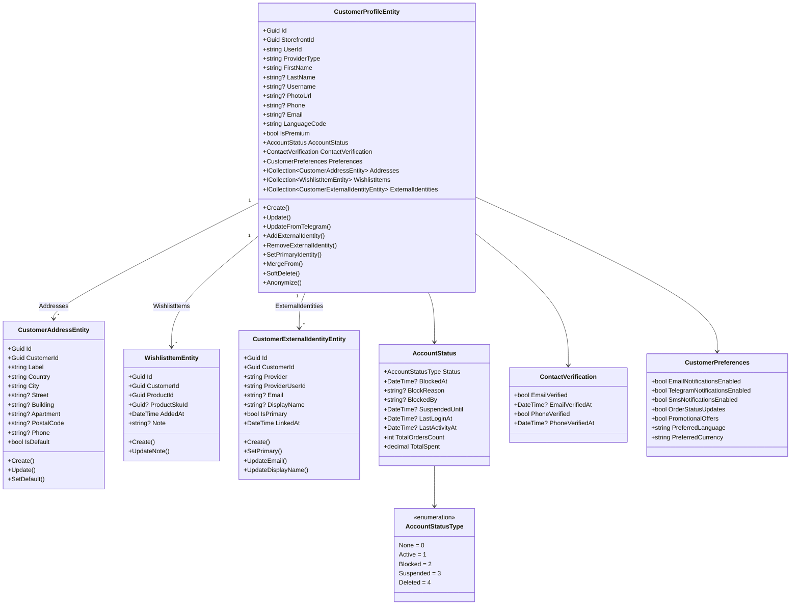

# DKH.CustomerService -- Domain Model

## Overview

DKH.CustomerService manages customer profiles, delivery addresses, wishlists, preferences, and external identity linking for Telegram Mini App storefronts. The domain follows DDD principles with a single aggregate root (`CustomerProfileEntity`) and three child entities.

## Class Diagram

## Entities

### CustomerProfileEntity

The aggregate root representing a customer profile scoped to a storefront. Implements `FullAuditedEntityWithKey<Guid>`, `IAggregateRoot`, and `IPlatformStorefrontScoped`.

| Property | Type | Constraints | Description |
|----------|------|-------------|-------------|
| `Id` | `Guid` | PK | Unique identifier |
| `StorefrontId` | `Guid` | Required | Multi-tenancy scope |
| `UserId` | `string` | Max 64 | External user identifier |
| `ProviderType` | `string` | Max 50, default `"Telegram"` | Authentication provider type |
| `FirstName` | `string` | Max 100 | Customer first name |
| `LastName` | `string?` | Max 100 | Customer last name |
| `Username` | `string?` | Max 100 | Username / handle |
| `PhotoUrl` | `string?` | Max 512 | Profile photo URL |
| `Phone` | `string?` | Max 32 | Phone number |
| `Email` | `string?` | Max 256 | Email address |
| `LanguageCode` | `string` | Max 10 | Preferred language code |
| `IsPremium` | `bool` | Default `false` | Premium account flag |
| `AccountStatus` | `AccountStatus` | Value object | Account status and activity tracking |
| `ContactVerification` | `ContactVerification` | Value object | Email/phone verification state |
| `Preferences` | `CustomerPreferences` | Value object | Notification and display preferences |
| `Addresses` | `ICollection<CustomerAddressEntity>` | Navigation | Delivery addresses |
| `WishlistItems` | `ICollection<WishlistItemEntity>` | Navigation | Wishlist items |
| `ExternalIdentities` | `ICollection<CustomerExternalIdentityEntity>` | Navigation | Linked external identities |

**Methods:**

| Method | Description |
|--------|-------------|
| `Create` | Factory method for creating a new customer profile |
| `Update` | Updates profile fields (name, phone, email, etc.) |
| `UpdateFromTelegram` | Syncs profile data from Telegram user info |
| `AddExternalIdentity` | Links a new external identity provider |
| `RemoveExternalIdentity` | Unlinks an external identity |
| `SetPrimaryIdentity` | Marks an external identity as primary |
| `MergeFrom` | Merges data from another customer profile (account linking) |
| `SoftDelete` | Marks the profile as deleted without physical removal |
| `Anonymize` | Removes PII for GDPR compliance |

### CustomerAddressEntity

A delivery address belonging to a customer. Implements `FullAuditedEntityWithKey<Guid>`.

| Property | Type | Constraints | Description |
|----------|------|-------------|-------------|
| `Id` | `Guid` | PK | Unique identifier |
| `CustomerId` | `Guid` | FK -> customer_profiles | Owning customer |
| `Label` | `string` | Max 64 | Address label (e.g., "Home", "Work") |
| `Country` | `string` | Max 100 | Country name |
| `City` | `string` | Max 100 | City name |
| `Street` | `string?` | Max 256 | Street address |
| `Building` | `string?` | Max 32 | Building number |
| `Apartment` | `string?` | Max 32 | Apartment / unit number |
| `PostalCode` | `string?` | Max 20 | Postal / ZIP code |
| `Phone` | `string?` | Max 32 | Contact phone for delivery |
| `IsDefault` | `bool` | | Whether this is the default address |

**Methods:**

| Method | Description |
|--------|-------------|
| `Create` | Factory method for creating a new address |
| `Update` | Updates address fields |
| `SetDefault` | Marks this address as the default |

### WishlistItemEntity

A product added to a customer's wishlist. Implements `FullAuditedEntityWithKey<Guid>`.

| Property | Type | Constraints | Description |
|----------|------|-------------|-------------|
| `Id` | `Guid` | PK | Unique identifier |
| `CustomerId` | `Guid` | FK -> customer_profiles | Owning customer |
| `ProductId` | `Guid` | Required | Product reference |
| `ProductSkuId` | `Guid?` | Optional | Specific SKU variant |
| `AddedAt` | `DateTime` | Required | When the item was added |
| `Note` | `string?` | Max 512 | Customer note about the item |

**Methods:**

| Method | Description |
|--------|-------------|
| `Create` | Factory method for adding a wishlist item |
| `UpdateNote` | Updates the note on a wishlist item |

### CustomerExternalIdentityEntity

An external identity provider linked to a customer (e.g., Google, Apple, email). Implements `FullAuditedEntityWithKey<Guid>`.

| Property | Type | Constraints | Description |
|----------|------|-------------|-------------|
| `Id` | `Guid` | PK | Unique identifier |
| `CustomerId` | `Guid` | FK -> customer_profiles | Owning customer |
| `Provider` | `string` | Max 50 | Identity provider name |
| `ProviderUserId` | `string` | Max 256 | User ID at the provider |
| `Email` | `string?` | Max 256 | Email from the provider |
| `DisplayName` | `string?` | Max 200 | Display name from the provider |
| `IsPrimary` | `bool` | | Whether this is the primary identity |
| `LinkedAt` | `DateTime` | Required | When the identity was linked |

**Methods:**

| Method | Description |
|--------|-------------|
| `Create` | Factory method for creating a new external identity link |
| `SetPrimary` | Marks this identity as the primary one |
| `UpdateEmail` | Updates the email from the provider |
| `UpdateDisplayName` | Updates the display name from the provider |

## Value Objects

### AccountStatus

Tracks the customer's account state, activity metrics, and administrative actions.

| Property | Type | Default | Description |
|----------|------|---------|-------------|
| `Status` | `AccountStatusType` | `None` | Current account status |
| `BlockedAt` | `DateTime?` | `null` | When the account was blocked |
| `BlockReason` | `string?` | `null` | Reason for blocking |
| `BlockedBy` | `string?` | `null` | Admin who blocked the account |
| `SuspendedUntil` | `DateTime?` | `null` | Suspension expiry date |
| `LastLoginAt` | `DateTime?` | `null` | Last login timestamp |
| `LastActivityAt` | `DateTime?` | `null` | Last activity timestamp |
| `TotalOrdersCount` | `int` | `0` | Lifetime order count |
| `TotalSpent` | `decimal(18,2)` | `0` | Lifetime spending total |

### ContactVerification

Tracks verification state for email and phone contacts.

| Property | Type | Default | Description |
|----------|------|---------|-------------|
| `EmailVerified` | `bool` | `false` | Whether email is verified |
| `EmailVerifiedAt` | `DateTime?` | `null` | When email was verified |
| `PhoneVerified` | `bool` | `false` | Whether phone is verified |
| `PhoneVerifiedAt` | `DateTime?` | `null` | When phone was verified |

### CustomerPreferences

Notification channels and display preferences for the customer.

| Property | Type | Default | Description |
|----------|------|---------|-------------|
| `EmailNotificationsEnabled` | `bool` | `true` | Receive email notifications |
| `TelegramNotificationsEnabled` | `bool` | `true` | Receive Telegram notifications |
| `SmsNotificationsEnabled` | `bool` | `false` | Receive SMS notifications |
| `OrderStatusUpdates` | `bool` | `true` | Receive order status updates |
| `PromotionalOffers` | `bool` | `false` | Receive promotional offers |
| `PreferredLanguage` | `string` | `"en"` | Preferred UI language |
| `PreferredCurrency` | `string` | `"USD"` | Preferred display currency |

## Enums

### AccountStatusType

| Value | Name | Description |
|-------|------|-------------|
| 0 | `None` | Default / unset |
| 1 | `Active` | Active customer |
| 2 | `Blocked` | Blocked by admin |
| 3 | `Suspended` | Temporarily suspended |
| 4 | `Deleted` | Soft-deleted |

## Domain Events

Domain events are published via MediatR through the `DomainEvents` collection on the aggregate root. Events are dispatched after successful persistence to ensure consistency.

*Last updated: February 2026*
