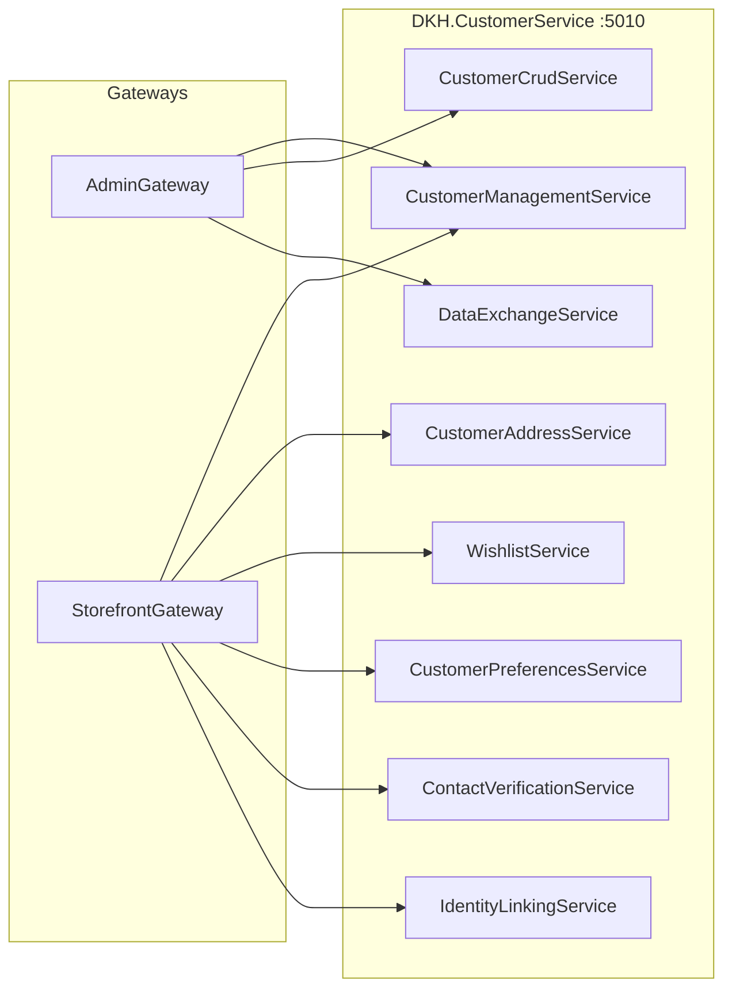

# DKH.CustomerService -- gRPC API

## Overview

DKH.CustomerService exposes 8 gRPC services on port **5010** (HTTP/2). The services are organized into two proto packages:

- `customer.services.v1` -- Admin/management operations
- `customer.api.v1` -- Storefront-facing operations

## Service Architecture



---

## 1. CustomerManagementService

**Package:** `customer.services.v1`
**Description:** Core profile management operations for both storefront and admin consumers.

### RPC Methods

| Method | Request | Response | Description |
|--------|---------|----------|-------------|
| `GetProfile` | `GetProfileRequest` | `CustomerProfileModel` | Get a customer profile by ID |
| `GetOrCreateProfile` | `GetOrCreateProfileRequest` | `CustomerProfileModel` | Get existing or create new profile from Telegram data |
| `UpdateProfile` | `UpdateProfileRequest` | `CustomerProfileModel` | Update profile fields |
| `DeleteProfile` | `DeleteProfileRequest` | `google.protobuf.Empty` | Soft-delete a customer profile |
| `CreateCustomer` | `CreateCustomerRequest` | `CustomerProfileModel` | Create a new customer (admin) |
| `UpdateCustomer` | `UpdateCustomerRequest` | `CustomerProfileModel` | Update customer data (admin) |
| `ExportCustomerData` | `ExportCustomerDataRequest` | `ExportCustomerDataResponse` | GDPR data export |
| `DeleteCustomerData` | `DeleteCustomerDataRequest` | `google.protobuf.Empty` | GDPR data deletion (anonymize) |

### Request Types

**GetProfileRequest**

| Field | Type | Description |
|-------|------|-------------|
| `customer_id` | `string` | Customer profile ID (GUID) |

**GetOrCreateProfileRequest**

| Field | Type | Description |
|-------|------|-------------|
| `user_id` | `string` | External user ID (e.g., Telegram user ID) |
| `provider_type` | `string` | Provider type (e.g., "Telegram") |
| `first_name` | `string` | First name |
| `last_name` | `string` | Last name |
| `username` | `string` | Username |
| `photo_url` | `string` | Photo URL |
| `language_code` | `string` | Language code |
| `is_premium` | `bool` | Premium account flag |

**UpdateProfileRequest**

| Field | Type | Description |
|-------|------|-------------|
| `customer_id` | `string` | Customer profile ID |
| `first_name` | `string` | Updated first name |
| `last_name` | `string` | Updated last name |
| `username` | `string` | Updated username |
| `phone` | `string` | Updated phone |
| `email` | `string` | Updated email |
| `language_code` | `string` | Updated language code |

**DeleteProfileRequest**

| Field | Type | Description |
|-------|------|-------------|
| `customer_id` | `string` | Customer profile ID |

**CreateCustomerRequest**

| Field | Type | Description |
|-------|------|-------------|
| `user_id` | `string` | External user ID |
| `provider_type` | `string` | Provider type |
| `first_name` | `string` | First name |
| `last_name` | `string` | Last name |
| `username` | `string` | Username |
| `phone` | `string` | Phone number |
| `email` | `string` | Email address |
| `language_code` | `string` | Language code |

**UpdateCustomerRequest**

| Field | Type | Description |
|-------|------|-------------|
| `customer_id` | `string` | Customer profile ID |
| `first_name` | `string` | First name |
| `last_name` | `string` | Last name |
| `phone` | `string` | Phone |
| `email` | `string` | Email |
| `language_code` | `string` | Language code |

**ExportCustomerDataRequest**

| Field | Type | Description |
|-------|------|-------------|
| `customer_id` | `string` | Customer profile ID |

**DeleteCustomerDataRequest**

| Field | Type | Description |
|-------|------|-------------|
| `customer_id` | `string` | Customer profile ID |

---

## 2. CustomerCrudService

**Package:** `customer.services.v1`
**Description:** Admin-facing operations for searching, listing, and moderating customers.

### RPC Methods

| Method | Request | Response | Description |
|--------|---------|----------|-------------|
| `SearchCustomers` | `SearchCustomersRequest` | `SearchCustomersResponse` | Full-text search across customer profiles |
| `ListCustomers` | `ListCustomersRequest` | `ListCustomersResponse` | Paginated customer list with filters |
| `GetCustomerStats` | `GetCustomerStatsRequest` | `CustomerStatsResponse` | Aggregated customer statistics |
| `BlockCustomer` | `BlockCustomerRequest` | `CustomerProfileModel` | Block a customer account |
| `UnblockCustomer` | `UnblockCustomerRequest` | `CustomerProfileModel` | Unblock a customer account |
| `SuspendCustomer` | `SuspendCustomerRequest` | `CustomerProfileModel` | Temporarily suspend a customer |

### Request Types

**SearchCustomersRequest**

| Field | Type | Description |
|-------|------|-------------|
| `query` | `string` | Search query (name, email, phone, username) |
| `page` | `int32` | Page number |
| `page_size` | `int32` | Items per page |

**ListCustomersRequest**

| Field | Type | Description |
|-------|------|-------------|
| `page` | `int32` | Page number |
| `page_size` | `int32` | Items per page |
| `status` | `AccountStatusType` | Filter by account status |
| `sort_by` | `string` | Sort field |
| `sort_direction` | `string` | Sort direction (asc/desc) |

**BlockCustomerRequest**

| Field | Type | Description |
|-------|------|-------------|
| `customer_id` | `string` | Customer profile ID |
| `reason` | `string` | Block reason |

**UnblockCustomerRequest**

| Field | Type | Description |
|-------|------|-------------|
| `customer_id` | `string` | Customer profile ID |

**SuspendCustomerRequest**

| Field | Type | Description |
|-------|------|-------------|
| `customer_id` | `string` | Customer profile ID |
| `suspended_until` | `google.protobuf.Timestamp` | Suspension expiry |
| `reason` | `string` | Suspension reason |

### Response Types

**SearchCustomersResponse / ListCustomersResponse**

| Field | Type | Description |
|-------|------|-------------|
| `items` | `repeated CustomerProfileModel` | Customer profiles |
| `total_count` | `int32` | Total matching records |
| `page` | `int32` | Current page |
| `page_size` | `int32` | Page size |

---

## 3. CustomerAddressService

**Package:** `customer.api.v1`
**Description:** CRUD operations for customer delivery addresses.

### RPC Methods

| Method | Request | Response | Description |
|--------|---------|----------|-------------|
| `ListAddresses` | `ListAddressesRequest` | `ListAddressesResponse` | List all addresses for a customer |
| `GetAddress` | `GetAddressRequest` | `CustomerAddressModel` | Get a single address by ID |
| `CreateAddress` | `CreateAddressRequest` | `CustomerAddressModel` | Create a new delivery address |
| `UpdateAddress` | `UpdateAddressRequest` | `CustomerAddressModel` | Update an existing address |
| `DeleteAddress` | `DeleteAddressRequest` | `google.protobuf.Empty` | Delete an address |
| `SetDefaultAddress` | `SetDefaultAddressRequest` | `CustomerAddressModel` | Set an address as the default |
| `GetDefaultAddress` | `GetDefaultAddressRequest` | `CustomerAddressModel` | Get the default delivery address |

### Request Types

**ListAddressesRequest**

| Field | Type | Description |
|-------|------|-------------|
| `customer_id` | `string` | Customer profile ID |

**GetAddressRequest**

| Field | Type | Description |
|-------|------|-------------|
| `address_id` | `string` | Address ID |

**CreateAddressRequest**

| Field | Type | Description |
|-------|------|-------------|
| `customer_id` | `string` | Customer profile ID |
| `label` | `string` | Address label |
| `country` | `string` | Country |
| `city` | `string` | City |
| `street` | `string` | Street |
| `building` | `string` | Building |
| `apartment` | `string` | Apartment |
| `postal_code` | `string` | Postal code |
| `phone` | `string` | Contact phone |
| `is_default` | `bool` | Set as default |

**UpdateAddressRequest**

| Field | Type | Description |
|-------|------|-------------|
| `address_id` | `string` | Address ID |
| `label` | `string` | Address label |
| `country` | `string` | Country |
| `city` | `string` | City |
| `street` | `string` | Street |
| `building` | `string` | Building |
| `apartment` | `string` | Apartment |
| `postal_code` | `string` | Postal code |
| `phone` | `string` | Contact phone |

**DeleteAddressRequest**

| Field | Type | Description |
|-------|------|-------------|
| `address_id` | `string` | Address ID |

**SetDefaultAddressRequest**

| Field | Type | Description |
|-------|------|-------------|
| `customer_id` | `string` | Customer profile ID |
| `address_id` | `string` | Address ID to set as default |

**GetDefaultAddressRequest**

| Field | Type | Description |
|-------|------|-------------|
| `customer_id` | `string` | Customer profile ID |

---

## 4. WishlistService

**Package:** `customer.api.v1`
**Description:** Manage customer product wishlists.

### RPC Methods

| Method | Request | Response | Description |
|--------|---------|----------|-------------|
| `GetWishlist` | `GetWishlistRequest` | `GetWishlistResponse` | Get paginated wishlist items |
| `AddToWishlist` | `AddToWishlistRequest` | `WishlistItemModel` | Add a product to the wishlist |
| `RemoveFromWishlist` | `RemoveFromWishlistRequest` | `google.protobuf.Empty` | Remove a product from the wishlist |
| `CheckProductInWishlist` | `CheckProductInWishlistRequest` | `CheckProductInWishlistResponse` | Check if a product is in the wishlist |
| `ClearWishlist` | `ClearWishlistRequest` | `google.protobuf.Empty` | Remove all items from the wishlist |
| `GetWishlistCount` | `GetWishlistCountRequest` | `GetWishlistCountResponse` | Get the total number of wishlist items |

### Request Types

**GetWishlistRequest**

| Field | Type | Description |
|-------|------|-------------|
| `customer_id` | `string` | Customer profile ID |
| `page` | `int32` | Page number |
| `page_size` | `int32` | Items per page |

**AddToWishlistRequest**

| Field | Type | Description |
|-------|------|-------------|
| `customer_id` | `string` | Customer profile ID |
| `product_id` | `string` | Product ID |
| `product_sku_id` | `string` | Product SKU ID (optional) |
| `note` | `string` | Customer note (optional) |

**RemoveFromWishlistRequest**

| Field | Type | Description |
|-------|------|-------------|
| `customer_id` | `string` | Customer profile ID |
| `product_id` | `string` | Product ID |
| `product_sku_id` | `string` | Product SKU ID (optional) |

**CheckProductInWishlistRequest**

| Field | Type | Description |
|-------|------|-------------|
| `customer_id` | `string` | Customer profile ID |
| `product_id` | `string` | Product ID |
| `product_sku_id` | `string` | Product SKU ID (optional) |

**ClearWishlistRequest**

| Field | Type | Description |
|-------|------|-------------|
| `customer_id` | `string` | Customer profile ID |

**GetWishlistCountRequest**

| Field | Type | Description |
|-------|------|-------------|
| `customer_id` | `string` | Customer profile ID |

### Response Types

**GetWishlistResponse**

| Field | Type | Description |
|-------|------|-------------|
| `items` | `repeated WishlistItemModel` | Wishlist items |
| `total_count` | `int32` | Total items in wishlist |
| `page` | `int32` | Current page |
| `page_size` | `int32` | Page size |

**CheckProductInWishlistResponse**

| Field | Type | Description |
|-------|------|-------------|
| `in_wishlist` | `bool` | Whether the product is in the wishlist |

**GetWishlistCountResponse**

| Field | Type | Description |
|-------|------|-------------|
| `count` | `int32` | Total wishlist item count |

---

## 5. CustomerPreferencesService

**Package:** `customer.api.v1`
**Description:** Manage customer notification and display preferences.

### RPC Methods

| Method | Request | Response | Description |
|--------|---------|----------|-------------|
| `GetPreferences` | `GetPreferencesRequest` | `CustomerPreferencesModel` | Get current preferences |
| `UpdatePreferences` | `UpdatePreferencesRequest` | `CustomerPreferencesModel` | Update all preferences |
| `UpdateNotificationChannels` | `UpdateNotificationChannelsRequest` | `CustomerPreferencesModel` | Update notification channel toggles |
| `UpdateNotificationTypes` | `UpdateNotificationTypesRequest` | `CustomerPreferencesModel` | Update notification type toggles |

### Request Types

**GetPreferencesRequest**

| Field | Type | Description |
|-------|------|-------------|
| `customer_id` | `string` | Customer profile ID |

**UpdatePreferencesRequest**

| Field | Type | Description |
|-------|------|-------------|
| `customer_id` | `string` | Customer profile ID |
| `preferred_language` | `string` | Language code |
| `preferred_currency` | `string` | Currency code |
| `email_notifications_enabled` | `bool` | Email notifications toggle |
| `telegram_notifications_enabled` | `bool` | Telegram notifications toggle |
| `sms_notifications_enabled` | `bool` | SMS notifications toggle |
| `order_status_updates` | `bool` | Order status updates toggle |
| `promotional_offers` | `bool` | Promotional offers toggle |

**UpdateNotificationChannelsRequest**

| Field | Type | Description |
|-------|------|-------------|
| `customer_id` | `string` | Customer profile ID |
| `email_notifications_enabled` | `bool` | Email notifications toggle |
| `telegram_notifications_enabled` | `bool` | Telegram notifications toggle |
| `sms_notifications_enabled` | `bool` | SMS notifications toggle |

**UpdateNotificationTypesRequest**

| Field | Type | Description |
|-------|------|-------------|
| `customer_id` | `string` | Customer profile ID |
| `order_status_updates` | `bool` | Order status updates toggle |
| `promotional_offers` | `bool` | Promotional offers toggle |

---

## 6. ContactVerificationService

**Package:** `customer.api.v1`
**Description:** Email and phone verification via OTP codes.

### RPC Methods

| Method | Request | Response | Description |
|--------|---------|----------|-------------|
| `InitiateEmailVerification` | `InitiateEmailVerificationRequest` | `InitiateVerificationResponse` | Send email verification code |
| `VerifyEmail` | `VerifyEmailRequest` | `VerifyResponse` | Verify email with OTP code |
| `InitiatePhoneVerification` | `InitiatePhoneVerificationRequest` | `InitiateVerificationResponse` | Send phone verification code |
| `VerifyPhone` | `VerifyPhoneRequest` | `VerifyResponse` | Verify phone with OTP code |

### Request Types

**InitiateEmailVerificationRequest**

| Field | Type | Description |
|-------|------|-------------|
| `customer_id` | `string` | Customer profile ID |
| `email` | `string` | Email address to verify |

**VerifyEmailRequest**

| Field | Type | Description |
|-------|------|-------------|
| `customer_id` | `string` | Customer profile ID |
| `code` | `string` | OTP verification code |

**InitiatePhoneVerificationRequest**

| Field | Type | Description |
|-------|------|-------------|
| `customer_id` | `string` | Customer profile ID |
| `phone` | `string` | Phone number to verify |

**VerifyPhoneRequest**

| Field | Type | Description |
|-------|------|-------------|
| `customer_id` | `string` | Customer profile ID |
| `code` | `string` | OTP verification code |

### Response Types

**InitiateVerificationResponse**

| Field | Type | Description |
|-------|------|-------------|
| `success` | `bool` | Whether the code was sent |
| `expires_at` | `google.protobuf.Timestamp` | Code expiry time |

**VerifyResponse**

| Field | Type | Description |
|-------|------|-------------|
| `verified` | `bool` | Whether verification succeeded |

---

## 7. IdentityLinkingService

**Description:** Manage external identity providers linked to customer accounts.

### RPC Methods

| Method | Request | Response | Description |
|--------|---------|----------|-------------|
| `LinkIdentity` | `LinkIdentityRequest` | `ExternalIdentityModel` | Link a new external identity |
| `UnlinkIdentity` | `UnlinkIdentityRequest` | `google.protobuf.Empty` | Remove an external identity |
| `ListIdentities` | `ListIdentitiesRequest` | `ListIdentitiesResponse` | List all linked identities |
| `SetPrimaryIdentity` | `SetPrimaryIdentityRequest` | `ExternalIdentityModel` | Set an identity as primary |
| `GetIdentity` | `GetIdentityRequest` | `ExternalIdentityModel` | Get a specific identity by ID |

### Request Types

**LinkIdentityRequest**

| Field | Type | Description |
|-------|------|-------------|
| `customer_id` | `string` | Customer profile ID |
| `provider` | `string` | Identity provider name |
| `provider_user_id` | `string` | User ID at the provider |
| `email` | `string` | Email from the provider |
| `display_name` | `string` | Display name from the provider |

**UnlinkIdentityRequest**

| Field | Type | Description |
|-------|------|-------------|
| `customer_id` | `string` | Customer profile ID |
| `identity_id` | `string` | External identity ID |

**ListIdentitiesRequest**

| Field | Type | Description |
|-------|------|-------------|
| `customer_id` | `string` | Customer profile ID |

**SetPrimaryIdentityRequest**

| Field | Type | Description |
|-------|------|-------------|
| `customer_id` | `string` | Customer profile ID |
| `identity_id` | `string` | External identity ID |

**GetIdentityRequest**

| Field | Type | Description |
|-------|------|-------------|
| `identity_id` | `string` | External identity ID |

### Response Types

**ListIdentitiesResponse**

| Field | Type | Description |
|-------|------|-------------|
| `items` | `repeated ExternalIdentityModel` | Linked identities |

---

## 8. DataExchangeService

**Description:** Standard data import/export operations using the DKH.Platform DataExchange pattern.

### RPC Methods

| Method | Request | Response | Description |
|--------|---------|----------|-------------|
| `Import` | `stream ImportRequest` | `ImportResponse` | Import customer data (streaming) |
| `Export` | `ExportRequest` | `stream ExportResponse` | Export customer data (streaming) |
| `GetImportTemplate` | `GetImportTemplateRequest` | `GetImportTemplateResponse` | Get import template definition |

---

## Error Handling

All services use standard gRPC status codes for error signaling:

| Scenario | Status Code |
|----------|-------------|
| Entity not found | `NOT_FOUND` |
| Validation error | `INVALID_ARGUMENT` |
| Duplicate entity | `ALREADY_EXISTS` |
| Unauthorized | `UNAUTHENTICATED` |
| Permission denied | `PERMISSION_DENIED` |
| Success | Return model directly |

Error details are provided via `Status.Detail` for debugging.

---

## Connection

```
Host: localhost
Port: 5010
Protocol: HTTP/2 (gRPC)
```

*Last updated: February 2026*
